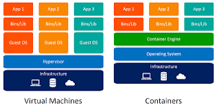
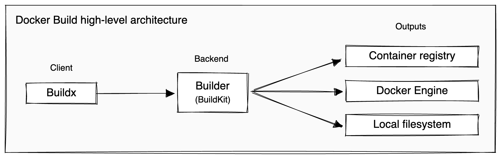

<h1>🌀 Inception</h1>

## ⭕ Overview

The Inception project ocuses on system administration and virtualization concepts. 
The objective is to create a small infrastructure with services 
like WordPress, MariaDB, and NGINX, all orchestrated via Docker Compose, 
while ensuring each service runs in its own container.


## 🧠 Table of Contents
- [Overview](#Overview)
- [Concepts](#Concepts)
- [Installation](#Installation)
- [Usage](#Usage)
- [Useful link](#Usefull-link)

## 👩🏻‍🚀 Concepts
### what is docker?
    Is a platform/software that lets develop, distribute run applications in containers.
### how does docker work?
    Docker uses a client-server architecture. The Docker client talks to the Docker daemon, which does the heavy lifting of building, running, and distributing your Docker containers.
### what is a container?

    is an env that will hold your code, libraries, and dependencies for the application to work, Docker Containers are simple **Linux Processes** with some **additional configurations**
    
### the difference between virtual machines and containers
    
    A VM lets you run a virtual machine on any hardware. Docker lets you run an application on any operating system

### Docker architecture





<br />

for more infos check my notion documentaion [notion](https://www.notion.so/INCEPTION-b8788625d9e84720a9ca89def88aa1ff)

<h2>⬇️ installation</h2>
<ol>
    <li>
        Clone the repository:
        <pre><code class="language-bash">git clone repository-url Inception</code></pre>
        <pre><code class="language-bash">cd Inception</code></pre>
</ol>

<h2>🛠️ Usage</h2>
    <p>Open the browser </p>
    <pre><code class="language-bash">http://localhost:8000</code></pre>


## 💡 Learned Concepts
* Docker compose
    ```yaml
        version: "3"

        services:
        # ===================mariadb=====================
        mariadb:
            container_name: mariadb
            env_file:
            - .env
            build: ./requirements/mariaDB
            restart: always 
            image: mariadb:inception
            expose:
            - "3306"
            volumes:
            - mariadb:/var/lib/mysql
            networks:
            - inception

    ```
* Docker file
    ```bash
        FROM debian:bullseye

        RUN apt-get update && apt-get install -y mariadb-server
        
        RUN sed -i 's/bind-address            = 127.0.0.1/bind-address            =*/' /etc/mysql/mariadb.conf.d/50-server.cnf
        
        COPY ./conf/conf.sh /
        RUN chmod 777 /conf.sh
        
        CMD ["/conf.sh"]
    ```

## 🔥 Useful links


[namespaces](https://blog.quarkslab.com/digging-into-linux-namespaces-part-1.html)
  | [Docker Containers.](https://medium.com/geekculture/understanding-the-docker-containers-d5ee422bfd9d)  | [Operating System Containers vs. Application Containers](https://blog.risingstack.com/operating-system-containers-vs-application-containers/)  | [Docker Volume and Docker Network](https://medium.com/@ajitfawade/how-to-use-docker-volume-and-docker-network-for-devops-day-19-of-90-days-of-devops-c6140efbded1)  | [The Linux Process Journey — PID 1](https://medium.com/@boutnaru/the-linux-process-journey-pid-1-init-60765a069f17)  | [Docker Build architecture](https://docs.docker.com/build/architecture/)  | [Complete Docker Course](https://www.youtube.com/playlist?list=PLRe2b2lXY6rzrs4Buvce1Q62CbRxkKUR9)  | [🐳 Docker Containers under the hood](https://medium.com/sliit-foss/docker-containers-what-happens-under-the-hood-for-beginners-f63847fdd976)  | [Docker Networking Drivers](https://www.docker.com/blog/understanding-docker-networking-drivers-use-cases/)  | [Docker Networking with Docker Compose](https://medium.com/@maheshwar.ramkrushna/chap-13-docker-networking-with-docker-compose-example-and-configuration-cc5a8b2bdb2b)  | [Docker Networking](https://medium.com/@mmodi2561/docker-networking-9527e5ee7414)  | [Docker Networking](https://spacelift.io/blog/docker-networking)  | [Docker سلسلة تعلم](https://www.youtube.com/playlist?list=PLX1bW_GeBRhDkTf_jbdvBbkHs2LCWVeXZ)

<h2>👨‍💻 Happy coding</h2>